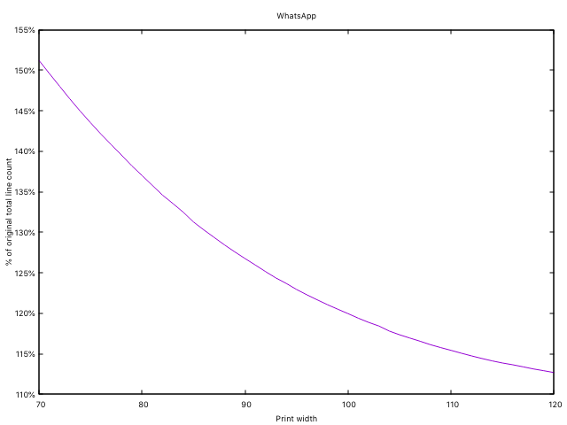
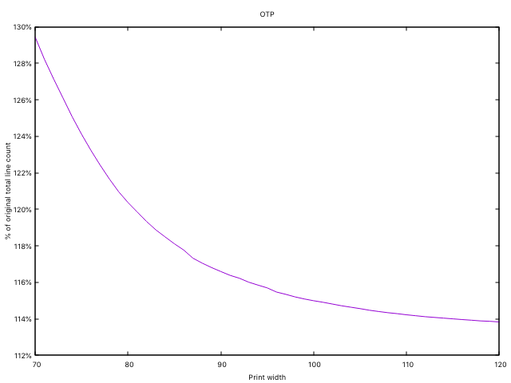

# Erlfmt: Default Width

Choosing a default line length where erlang code gets broken up by erlfmt is not an easy decision.  Even though it is configurable, the choice for default is still something we took seriously.  We took a data driven approach by doing an analysis of how much our formatter would impact code and a survey of what other formatters and style guides have chosen.

## Analysis

We started with an analysis of how much a chosen line length would impact the total line count of the code base both on our WhatsApp codebase and on OTP libraries.

### WhatsApp codebase



### OTP libraries



Unfortunately the curves don’t show a very pronounced inflection point, but we can still draw some conclusions.

The formatter at all tested print widths increases the total line count:

- at 80 it’s increased by 20% for OTP and 37% for WhatsApp
- at 100 it’s increased by 15% for OTP and 20% for WhatsApp
- at 120 it’s increased by 14% for OTP and 12% for WhatsApp

We can see there is a more significant reduction in total line count switching the limit from 80 to 100 (4% for OTP, 12% for WhatsApp) and a less significant reduction in total line count switching the limit from 100 to 120 (1% for OTP, 6% for WhatsApp).

Given we didn’t get enough signal from that experiment, we looked for other data points.

## Survey

We did a survey of what other formatters and style guides have chosen.

### Erlang Style Guides

- Inaka style guide: [100](https://github.com/inaka/erlang_guidelines#100-column-per-line)
- Elvis: [100](https://github.com/inaka/elvis_core/wiki/Rules#line-length)
- Joe Armstrong’s: [80](http://www.erlang.se/doc/programming_rules.shtml#:~:text=writing%20long%20lines.-,7.4%20Don't%20write%20very%20long%20lines,have%20more%20than%2080%20characters)
- WhatsApp Style Guide: 120
- Klarna Internal Guidance: 80

### Other Style Guides and Formatters

- rustfmt: 100
- elm-format: 80
- Python Black: 88
- Prettier: 80
- Gofmt: N/A (does not wrap lines)
- Elixir: 98
- Python PEP-8: “79, but it is okay to increase the line length limit up to 99 characters“
- Rubyfmt: [100](https://github.com/penelopezone/rubyfmt/issues/45#issuecomment-478662476)
- clang-format: [80](https://stackoverflow.com/questions/47683910/can-you-set-clang-formats-line-length)
- ktlint (Kotlin): [100](https://github.com/pinterest/ktlint#editorconfig)
- Swiftfmt: N/A (does not wrap lines)
- HTML: [80](https://developers.google.com/style/html-formatting)
- Facebook General: 80
- Google:
  - Java Formatter: [100](https://google.github.io/styleguide/javaguide.html#:~:text=Java%20code%20has%20a%20column%20limit%20of%20100%20characters)
  - Python: [80](https://google.github.io/styleguide/pyguide.html)
- GitHub: at 120 a horizontal scrollbar is added
- ReSharper: [100](https://www.jetbrains.com/help/resharper/Using_EditorConfig.html#what_is)
- CPP: [80](https://google.github.io/styleguide/cppguide.html#Line_Length)
- Scalafmt: [80](https://scalameta.org/scalafmt/docs/configuration.html)

[More Conventions](https://en.wikipedia.org/wiki/Characters_per_line)

The survey also didn’t find any real conclusion, except maybe that the most popular numbers are between 80 and a 100.

## Decision

In the end, the analyses didn’t show an inflection point and the survey also came up inconclusive. We decided to align with the Erlang linter Elvis’ choice of a line length of 100 characters. This meant deciding against 80 since the data showed a significant reduction in total line count switching the limit from 80 to 100 and also deciding against 120 since we couldn’t find any other formatter that chose anything above a 100.

## Appendix

### How to reproduce

Here is the script to reproduce the count the line length in a codebase

```bash
#!/bin/bash

set -e;

printf "# original "
rg '@generated|yeccpre\.hrl' --files-without-match $@ | xargs erlfmt --require-pragma | wc -l

for i in {70..120}; do
    >&2 echo "Processing $i"
    printf "$i "
    rg '@generated|yeccpre\.hrl' --files-without-match $@ | xargs erlfmt --print-width $i | wc -l
done
```
